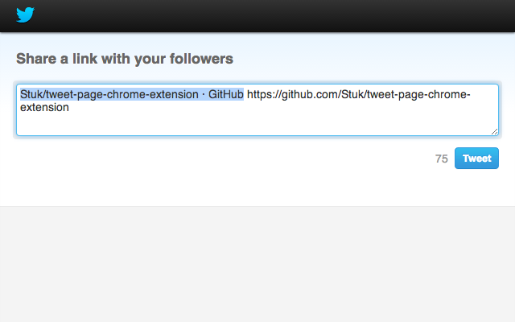

# Tweet Page Chrome Extension

A button that lets you tweet the current page and url.

That's all.

[Install it on the Chrome Web Store](https://chrome.google.com/webstore/detail/tweet-page/eobpfipgbnimppmpmcladpjdgeobmbaf).

## Screenshots

## License

2-clause BSD
